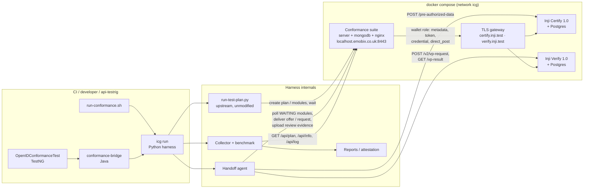
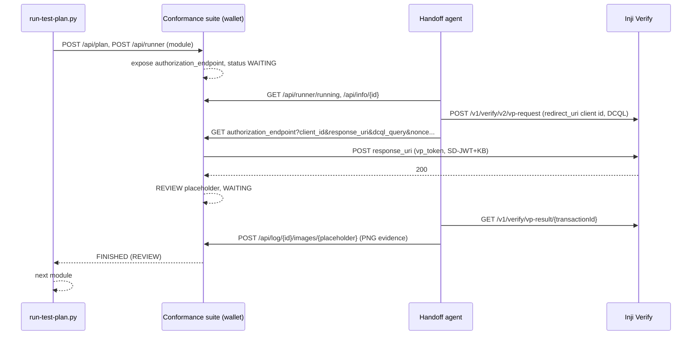

# Architecture

## Components

| Component | Responsibility |
|---|---|
| `run-conformance.sh` | One command: bootstrap pinned upstream assets, start compose profiles, run the harness, choose the exit code |
| `harness/icg/runner.py` | Renders config templates, runs the upstream `run-test-plan.py` per component, and maps plan ids back to plans |
| `harness/icg/agent.py` | Background worker. It finds modules in `WAITING` and dispatches them to component adapters |
| `harness/icg/handoff/` | `CertifyHandoff` and `VerifyHandoff`: the steps a human or a real wallet interaction would perform |
| `harness/icg/collect.py` | Pulls module status, result, findings and requirement tags from the suite |
| `harness/icg/benchmark.py` | Turns suite results into gate verdicts using the issue-linked benchmark |
| `harness/icg/report.py`, `diff.py`, `coverage.py`, `readiness.py`, `attest.py` | HTML/Markdown/JUnit/badge output, run diff, spec-clause coverage, HAIP gap report, in-toto statement |
| `testrig/conformance-bridge` | Dependency-light Java library. It launches the harness and parses `results.json` |
| `testrig/inji*/OpenIDConformanceTest` | TestNG class in each module's api-testrig. It emits one result per conformance module |
| `deploy/gateway` | TLS origins for Inji (the suite only talks https), plus disclosed compatibility shims |

## Run sequence (Verify, one module)

## Design decisions

1. **Keep the upstream runner unmodified.** `run-test-plan.py` already handles plan creation, parallel queues, server-restart retries, expected-failure analysis and signed exports. The harness runs it as a subprocess and adds only what it lacks, which is handoff to an external system. Upgrading the suite means changing one line in `deploy/versions.env`.
2. **Run the handoff agent alongside the script.** The agent polls the suite's own state (`/api/runner/running`, `/api/info`, `/api/runner/{id}` exposed values and URI-input requests). It does not parse script output, so it stays correct under parallel execution.
3. **Use Inji's real APIs for every handoff.** A credential offer comes from `POST /pre-authorized-data`, and the authorization request from `POST /v2/vp-request` rebuilt exactly as the Inji Verify SDK does. The suite therefore tests what a real wallet would see.
4. **Resolve REVIEW results with evidence instead of accepting them.** The suite cannot observe whether a verifier really verified a presentation. The resolver asks Inji Verify and compares that answer with the outcome encoded in the suite's placeholder condition (`ExpectVerifierSuccessfulVerificationPage` or `ExpectVerifierRejectedPresentationPage`).
5. **Keep one benchmark format.** Expected failures use the upstream `--expected-failures-file` schema, extended with `issue`. The same file drives the upstream analysis and the gate.
6. **Fail closed.** A gating plan that was never created or returned no modules gives exit code 2. It never counts as a pass. Unknown verdicts in Java map to `INCOMPLETE` and therefore fail.
7. **Disclose workarounds.** Any gateway compatibility route is declared in the plan manifest (`shims`) and printed in every report, next to its tracking issue.
8. **Pin everything.** Suite tag, Inji images and upstream refs live in `deploy/versions.env`. The upstream assets are fetched with sparse git checkouts, not vendored.

## Parallel execution

- `--parallel` runs the Certify and Verify plans concurrently, one `run-test-plan.py` per component.
- Each plan gets a run-unique alias (`icg-<run>-<plan>`), so the suite's callback URLs never collide.
- Within a plan, modules run sequentially because upstream serialises modules that share an alias.
- The single handoff agent serves both components.
- The measured combined run took about 35 s for 20 modules.

## Failure modes and how the gate handles them

| Failure | Detection | Result |
|---|---|---|
| Suite never creates the plan (bad config, suite down) | `parse_plan_ids` finds no plan id for a gating plan | `missing_plans()` non-empty → exit **2** (infrastructure), never counted as a pass |
| A gating plan is created but selects zero modules | `PlanRun.selected_modules` empty | exit **2** |
| A module never leaves `WAITING` (handoff agent didn't act, or Inji is unreachable) | upstream's own 240 s per-module timeout | module recorded `INCOMPLETE`; `is_blocking` → gate fails (exit 1), not silently skipped |
| A module ends `INTERRUPTED` after producing findings | `benchmark.classify` treats this as a failure, not a shrug | counts as `FAIL` unless benchmarked |
| A `REVIEW` result where Inji's own verdict disagrees with the suite's expected outcome (`icg:review-mismatch`) | `resolve_review` compares `vpResultStatus` against the placeholder's expected condition | `FAIL`, evidence card still attached so the mismatch is visible, not just asserted |
| A benchmarked failure starts passing | `classify` sees `PASSED` where the benchmark expected a failure | `STALE_BENCHMARK`, surfaced in the report so the benchmark entry gets removed instead of silently rotting |
| Unknown/new TestNG verdict reaches the Java bridge | `Verdict` enum mapping has no fallback to "pass" | maps to `INCOMPLETE` → fails closed |
| Three consecutive module failures (upstream default) | would abort the whole plan after only 3 failing modules, hiding the rest of the report | overridden via `CONFORMANCE_MAX_CONSECUTIVE_FAILURES=100` so a real benchmark run sees every module |

## Security and trust notes

- The suite trusts all certificates in dev mode (`verify=False` on the harness's own suite client, and the suite's own wallet role ignores TLS errors), which is why the gateway's self-signed cert is acceptable — this stack is a local/CI conformance rig, not a production topology, and it is never exposed outside the `icg` compose network.
- `CONFORMANCE_TOKEN` (bearer auth for a hosted suite) and any Inji credentials are read from the environment; none are committed, logged, or embedded in reports.
- The in-toto attestation (`icg attest`) records the tested image **digests**, so a signed statement can't be replayed against a different build; CI signs it keylessly with Sigstore/cosign rather than a long-lived key.
- Nothing in the harness sends data to a third-party service: the only network calls are to the local suite, the local Inji stack, and (in CI) GitHub's own artifact/attestation infrastructure.
